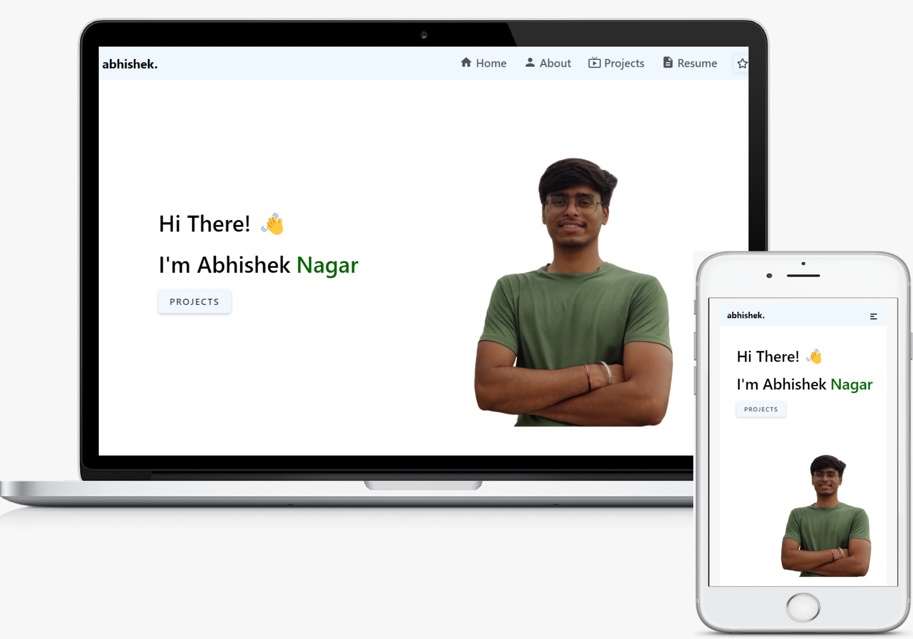

<h1 align="center">
  abhishek.<br/>
</h1>



This is my fully responsive portfolio website, proudly built with [React.js](https://react.dev/) and [SASS](https://sass-lang.com/). The content is managed through [npm](https://www.npmjs.com/) package manager by default but can be used with `yarn` as well.

This project is open source, so please feel free to fork and adapt for your own projects (credit would be appreciated).

## Built With

My personal portfolio <a href="https://abhisheknagar.vercel.app/" target="_blank">abhishek.</a> which features some of my GitHub projects as well as my resume and technical skills.<br/>

This project was built using these technologies.

- React.js
- SASS
- React Reveal(for animation)
- MUI and React Icons(for icons)
- Vercel


## Getting this project up and running

1.  **Fork or Clone**

    Fork or clone this project from GitHub to get your own copy of it.

1.  **Installation**

    This project uses the npm package manager. To get started, follow the [Getting Started Guide](https://www.npmjs.com/)

    Once this is installed you can run `npm install` in your project directory to install dependencies.

    ```sh
    cd portfolio/
    npm install
    ```
1.  **Start developing.**

    Navigate into your new site’s directory and start it up.

    ```sh
    npm start
    ```

1.  **Open the source code and start editing!**

    Your site is now running at `http://localhost:3000`!

    Open the `portfolio` directory in your code editor of choice and edit `files under src folder`. Save your changes and the browser will update in real time!

## Show your support
Give a ⭐ if you like this website!